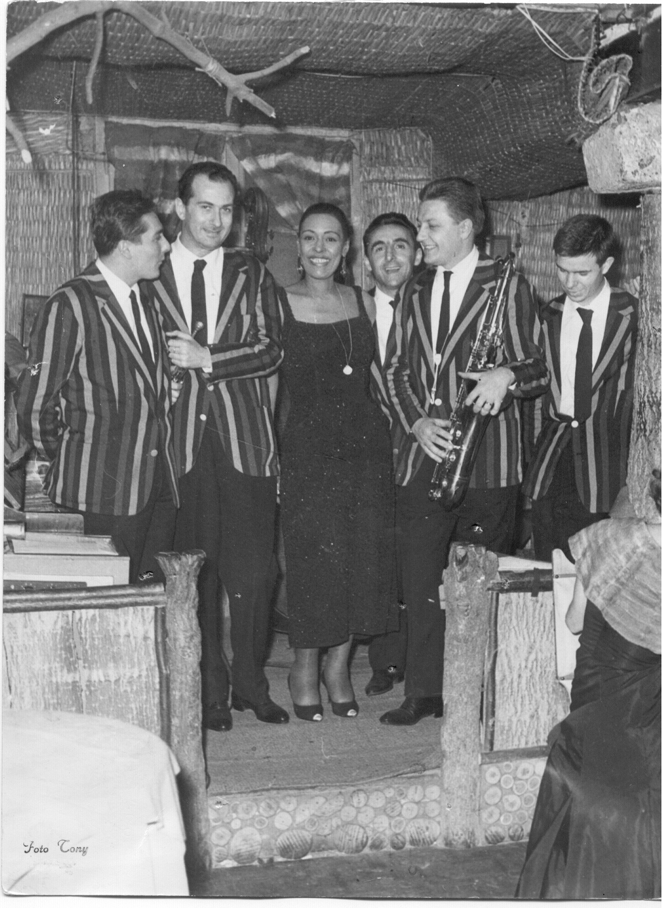

<b>“Milan 1958-62: Musical Topography of a City”</b> is a research project by [Martin Nicastro](https://www.martinnicastro.com/) (PhD). It revolves around the mapping of live music venues in the city of Milan at the time of the Italian economic boom.

The project was supervised by <b>Prof. Alessandro Bratus</b> (University of Pavia) and co-tutored by <b>Prof. Giovanni Pietro Vitali</b> (University of Versailles Saint-Quentin-en-Yvelines).

On this website are stored all the digital resources of the project. They are divided in three different sections, according to the methodological framework of the research: [mapping](https://musictopography.github.io//map/), [network visualization and analysis](https://musictopography.github.io//network_graphs/), [field research](https://musictopography.github.io//interviews/).

### Topics:

- Music, sound and space
- Italian popular music history
- Urban musicology
- Deep mapping
- Live music ecologies

Part of the project was realized with the support of Small Grants [AIUCD](https://www.aiucd.it/) 2022.

  

  Billie Holiday at Taverna Messicana, 3–8 November 1958, with Oscar Valdambrini, Gianni Basso, Enrico Intra, Gianni Cazzola and Giorgio Azzolini

